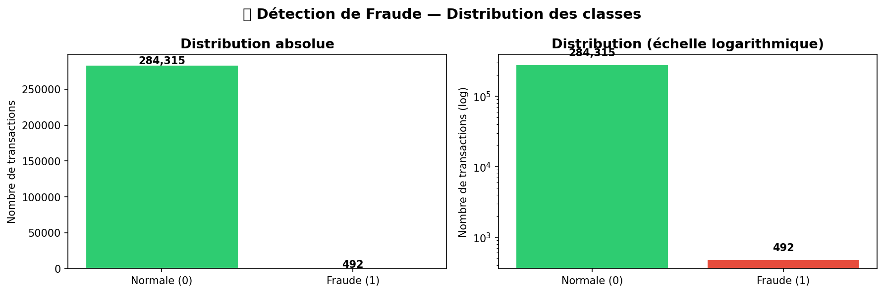
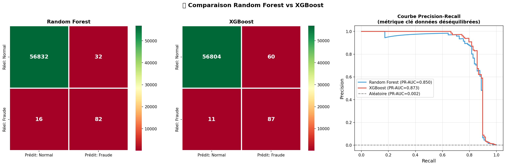

# 🏦 Détection de Fraude Bancaire

Détection de transactions frauduleuses par carte de crédit  
avec **XGBoost** et gestion du déséquilibre extrême par **SMOTE**.

---

## 🎯 Problème business

Sur 284 807 transactions réelles, seulement **492 sont des fraudes (0.17%)**.  
L'enjeu : détecter un maximum de fraudes sans bloquer  
les transactions légitimes des clients.

> "Manquer une fraude coûte ~100× plus cher  
>  que générer une fausse alerte."

---

## 🏆 Résultats finaux

| Métrique              | Score     |
|-----------------------|-----------|
| Recall (fraudes)      | **88.8%** |
| Precision             | 59.2%     |
| F1-Score              | 71.0%     |
| ROC-AUC               | 98.5%     |
| PR-AUC                | **87.3%** |
| Fraudes détectées     | 87 / 98   |
| Fraudes manquées      | 11        |
| Coût estimé (seuil optimal) | **6 100€** |

---

## 🔍 Insights clés — EDA

- **0.17%** de fraudes — déséquilibre extrême (1 fraude / 577 normales)
- Médiane des montants frauduleux : **9.25€**
  → Les fraudeurs testent avec de petits montants d'abord
- Pic de fraudes à **2h du matin** quand la surveillance est minimale
- **V17, V14, V12** sont les variables les plus discriminantes
- Les transactions normales suivent un rythme humain logique ;
  les fraudes ont un profil temporel radicalement différent

---

## ⚙️ Pipeline technique

Données brutes (284 807 transactions, 31 features)

↓

EDA — distribution, temporel, corrélations

↓

Feature Engineering — Hour, Period, Amount_log,
is_small_amount, is_night_peak

↓

Split Train/Test (80/20, stratifié)

↓

Normalisation — StandardScaler

↓

SMOTE — 394 → 22 745 fraudes synthétiques

↓

Entraînement — Random Forest vs XGBoost

↓

Évaluation — PR-AUC, Recall, Matrice de confusion

↓

Optimisation seuil — analyse coût business

↓

Décision finale — XGBoost, seuil 0.50

---

## 🤖 Choix du modèle — Raisonnement ingénieur

Trois scénarios testés :

| Seuil | Recall | FN | FP  | Coût estimé |
|-------|--------|----|-----|-------------|
| 0.01  | 90.8%  |  9 | 1013| 14 630€     |
| **0.50**  | **88.8%**  | **11** | **60** | **6 100€** ✅ |
| 0.98  | 81.6%  | 18 |  10 |  9 100€     |

**Seuil 0.50 retenu** — meilleur compromis coût/performance.  
Le seuil 0.01 génère trop de fausses alertes (service client submergé).  
Le seuil 0.98 rate trop de vraies fraudes (pertes directes).

---

## 🛠️ Stack technique

- **Python 3** — langage principal
- **Pandas / NumPy** — manipulation des données
- **Matplotlib / Seaborn** — visualisation
- **Scikit-learn** — preprocessing, métriques, Random Forest
- **XGBoost** — modèle principal de détection
- **imbalanced-learn (SMOTE)** — gestion du déséquilibre
- **Joblib** — sauvegarde du modèle
- **Google Colab** — environnement de développement

---

## 📁 Structure du projet
├── fraud_detection.ipynb     # Notebook complet annoté

├── xgboost_fraud.pkl         # Modèle XGBoost entraîné

├── scaler_fraud.pkl          # StandardScaler

├── config_modele.json        # Configuration et métriques

└── images/                   # Toutes les visualisations

├── distribution_fraude.png

├── analyse_montants.png

├── analyse_temporelle.png

├── variables_discriminantes.png

├── smote_effet.png

├── comparaison_modeles.png

└── optimisation_seuil.png

---

## 📈 Visualisations

### Distribution des classes

### Comparaison Random Forest vs XGBoost

---

## 👤 Auteur

**Mohamed Lamine**  
Ingénieur IA & Data Science  
[LinkedIn](#) · [GitHub](#)

---
